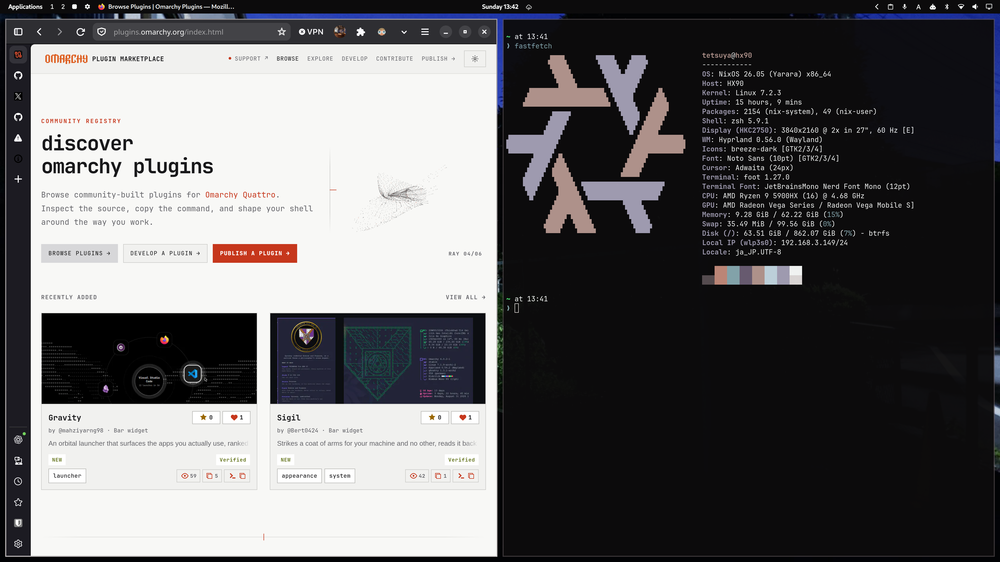

# Active Window

[English](#active-window) | [中文说明](#中文说明) | [日本語](#日本語)

Active Window is a native Omarchy top-bar widget that displays the current focused window's application icon and title in the top bar. When on an empty workspace or desktop, it seamlessly transitions to display the Linux distribution's official logo and version number (such as NixOS 26.05, Arch Linux, Fedora, Ubuntu, Debian, etc.).



_Active Window running in the top bar of Omarchy Quattro, showing the focused application icon and window title, and switching to the distribution logo and version on an empty desktop._

## Features

- **Active Window Identity**: Displays the focused window's native application icon and window title with clean right-side eliding.
- **Empty Desktop Awareness**: Automatically detects when no window is active on the workspace and switches to system identity.
- **System Distro Logo & Version**: Displays the Linux distribution's official SVG logo alongside its version name/number (e.g. `❄ NixOS 26.05`) on an empty desktop.
- **Built-in Distro Logo Pack**: Pre-packaged with clean, scalable SVG logos for 16+ major distributions:
  - NixOS (viewBox cropped and rendered cleanly)
  - Arch Linux
  - Fedora
  - Ubuntu
  - Debian
  - openSUSE
  - Manjaro
  - Alpine Linux
  - Gentoo Linux
  - Linux Mint
  - Pop!_OS
  - Zorin OS
  - CentOS
  - Red Hat Enterprise Linux
  - Rocky Linux
  - Endless OS / Generic Linux fallback
- **Native os-release Parsing**: Reads `/etc/os-release` natively using `Quickshell.Io.FileView` with zero shell subprocesses or external dependencies.
- **Themed App Icon Resolution**: Resolves application icons directly using Quickshell's native icon theme engine with fallback to a capitalized letter badge.
- **Dynamic Content-Hugging Width**: Pill width smoothly hugs the label and icon with animated transitions, bounded by a configurable maximum width (`maxWidth`, default 280px).
- **Tooltip On Hover**: Long or truncated titles automatically reveal their full text via Omarchy's native tooltip on mouse hover.
- **Clean Chrome Integration**: Operates as a purely informational status indicator without intrusive click cursors or hover background fills.
- **Zero Daemons**: Lightweight QML implementation running entirely inside Quickshell with no background services or CPU overhead.

## Installation

Install the plugin using Omarchy's plugin manager:

```sh
omarchy plugin add https://github.com/iamcheyan/omarchy-active-window.git --enable
```

The plugin registers a `bar-widget` entry point. If the widget is not positioned automatically, add **Active Window** to the `left` section of your top bar:

```sh
omarchy plugin enable iamcheyan.active-window left
```

## Configuration

Settings can be customized directly in `~/.config/omarchy/shell.json`:

```json
{
  "id": "iamcheyan.active-window",
  "maxWidth": 320
}
```

- `maxWidth` — Maximum pixel width before window titles are elided (default: `280`).

## Files

- `manifest.json` — Plugin metadata and `bar-widget` entry point declaration.
- `BarWidget.qml` — Primary top bar widget component implementing focus tracking and distro detection.
- `icons/` — Scalable SVG logos for supported Linux distributions.
- `preview.png` — Screenshot preview asset for documentation and marketplace listing.

## Dependencies

All required runtime components are provided by standard Omarchy and Wayland desktop environments:

- Omarchy Quickshell runtime (`quickshell`)
- Hyprland / Wayland compositor with `zwlr_foreign_toplevel_management_v1`
- Standard Linux `/etc/os-release` file

No additional background services or external packages are required.

## Uninstallation

Disable or remove the plugin via Omarchy's plugin manager:

```sh
omarchy plugin remove iamcheyan.active-window
```

## Validation

Validate the plugin repository against the Omarchy plugin manifest schema:

```sh
omarchy plugin validate .
```

## License

MIT. See [LICENSE](LICENSE).

---

# 中文说明

[English](#active-window) | [中文说明](#中文说明) | [日本語](#日本語)

Active Window 是一个为 Omarchy 桌面环境量身打造的原生状态栏小部件，用于在顶部栏左侧优雅呈现当前活动窗口的应用图标与标题。当切换至空白工作区或桌面时，小部件会自动无缝切换显示当前 Linux 发行版的官方矢量图标与系统版本号（例如 NixOS 26.05、Arch Linux、Fedora、Ubuntu、Debian 等）。


_运行于 Omarchy Quattro 顶栏中的 Active Window 小部件，窗口聚焦时展示应用图标与标题，桌面状态展示发行版 Logo 与版本号。_

## 功能特性

- **活动窗口标识**：顶栏实时呈现当前获得焦点的窗口图标及完整标题，超出长度时平滑省略。
- **空白桌面智能感知**：自动监听当前工作区窗口状态，无窗口打开时平滑过渡至系统状态展示。
- **发行版 Logo 与版本展示**：桌面状态下清晰展示当前发行版的官方 SVG 图标及系统版本号（例如 `❄ NixOS 26.05`）。
- **内置矢量图标包**：包含 16+ 主流 Linux 发行版高精度 SVG 矢量图标：
  - NixOS（优化裁剪 viewBox 并去除冗余黑底）
  - Arch Linux
  - Fedora
  - Ubuntu
  - Debian
  - openSUSE
  - Manjaro
  - Alpine Linux
  - Gentoo Linux
  - Linux Mint
  - Pop!_OS
  - Zorin OS
  - CentOS
  - Red Hat Enterprise Linux
  - Rocky Linux 等
- **原生 os-release 解析**：通过 `Quickshell.Io.FileView` 原生读取 `/etc/os-release`，不派生任何 Shell 子进程或外部工具。
- **主题应用图标查找**：直接使用 Quickshell 原生主题图标查找引擎解析应用图标，并提供首字母兜底头像。
- **内容自适应收缩**：宽度根据当前标题长度平滑贴合，并受可配置的最大宽度约束（`maxWidth`，默认 280px）。
- **完整标题 Tooltip**：当标题过长被省略时，鼠标悬停会自动触发 Omarchy 原生 Tooltip 展示完整标题。
- **自然融入顶栏**：作为纯粹的信息指示部件，无突兀的悬停底色和手型指针，视觉自然协调。
- **零额外守护进程**：纯 QML 实现，完全在 Quickshell 进程内运行，轻量高效无后台常驻负担。

## 安装方法

使用 Omarchy 插件管理器安装：

```sh
omarchy plugin add https://github.com/iamcheyan/omarchy-active-window.git --enable
```

本插件注册 `bar-widget` 入口。如需手动调整或启用至顶栏左侧：

```sh
omarchy plugin enable iamcheyan.active-window left
```

## 配置项

可在 `~/.config/omarchy/shell.json` 的布局项中指定配置参数：

```json
{
  "id": "iamcheyan.active-window",
  "maxWidth": 320
}
```

- `maxWidth` — 标题区域的最大像素宽度，超过此宽度将触发右侧文字省略（默认值：`280`）。

## 文件结构

- `manifest.json` — 插件元数据契约与 `bar-widget` 入口声明。
- `BarWidget.qml` — 顶栏部件核心实现，包含窗口状态跟踪与系统发行版解析。
- `icons/` — 内置 Linux 各大发行版官方 SVG 矢量图标。
- `preview.png` — 用于文档展示与插件市场审核的实机效果预览图。

## 系统依赖

依赖项均由标准的 Omarchy 与 Wayland 桌面基础环境提供：

- Omarchy Quickshell 运行环境
- 支持 `zwlr_foreign_toplevel_management_v1` 协议的 Wayland 合成器（如 Hyprland）
- 标准 Linux `/etc/os-release` 文件

无需安装其他第三方依赖或守护进程。

## 卸载方法

通过 Omarchy 插件管理器卸载：

```sh
omarchy plugin remove iamcheyan.active-window
```

## 本地验证

在插件仓库根目录下执行静态合规检查：

```sh
omarchy plugin validate .
```

## 许可证

MIT 开源许可证，详见 [LICENSE](LICENSE)。

---

# 日本語

[English](#active-window) | [中文说明](#中文说明) | [日本語](#日本語)

Active Window は、トップバーの左側に現在フォーカスされているウィンドウのアプリケーションアイコンとタイトルを表示する、Omarchy Quattro 向けステータスバーウィジェットです。ワークスペース上にウィンドウがないデスクトップ状態のときは、自動的に利用中の Linux ディストリビューション公式ロゴとバージョン番号（NixOS 26.05、Arch Linux、Fedora、Ubuntu、Debian など）を表示します。


_Omarchy Quattro のトップバーで動作する Active Window ウィジェット。ウィンドウフォーカス時はアプリアイコンとタイトルを表示し、空白デスクトップ時はディストリビューションロゴとバージョンを表示します。_

## 主な機能

- **アクティブウィンドウ情報表示**：フォーカス中のウィンドウアイコンとタイトルをトップバーにリアルタイム表示。長文タイトルは右側を自然に省略表示。
- **空デスクトップ状態の自動検知**：ワークスペースにウィンドウが存在しない状態を自動判別し、システム情報表示へシームレスに切り替え。
- **ディストリビューションロゴとバージョン**：デスクトップ表示時は公式 SVG アイコンとバージョン（例：`❄ NixOS 26.05`）を表示。
- **内蔵ベクターアイコンパック**：主要 16 種類以上の Linux ディストリビューションの公式 SVG アイコンを内蔵：
  - NixOS（viewBox を最適化し、黒背景の描画バグを解消済み）
  - Arch Linux
  - Fedora
  - Ubuntu
  - Debian
  - openSUSE
  - Manjaro
  - Alpine Linux
  - Gentoo Linux
  - Linux Mint
  - Pop!_OS
  - Zorin OS
  - CentOS
  - Red Hat Enterprise Linux
  - Rocky Linux など
- **ネイティブな os-release 解析**：`Quickshell.Io.FileView` を使用して `/etc/os-release` を直接解析。シェルプロセスや外部コマンドの呼び出しは一切行いません。
- **テーマアイコンの自動解決**：Quickshell のテーマ解決エンジンを用いてアプリ名から正確なアイコンを取得。見つからない場合は頭文字バッジでフォールバック。
- **コンテンツに応じた自動幅調整**：タイトル文字数に合わせて自然に幅が収縮。設定された最大幅（`maxWidth`、デフォルト 280px）で安全にクランプ。
- **ホバー時ツールチップ**：タイトルが省略されている場合でも、マウスカーソルを合わせることで Omarchy 標準のツールチップで全文を表示。
- **トップバーに馴染むミニマル設計**：情報表示に特化し、不要なホバー背景や指差しカーソルを排してシステムバーと調和。
- **追加デーモン不要**：Quickshell プロセス内で完結して軽量動作し、バックグラウンドでの負荷がありません。

## インストール

Omarchy プラグインマネージャーを使用してインストールします：

```sh
omarchy plugin add https://github.com/iamcheyan/omarchy-active-window.git --enable
```

本プラグインは `bar-widget` エントリーポイントを提供します。トップバーの左側に配置したい場合は次を実行してください：

```sh
omarchy plugin enable iamcheyan.active-window left
```

## 設定

`~/.config/omarchy/shell.json` の設定項目で最大幅をカスタマイズできます：

```json
{
  "id": "iamcheyan.active-window",
  "maxWidth": 320
}
```

- `maxWidth` — タイトル表示領域の最大ピクセル幅。これを超えると省略表示されます（デフォルト：`280`）。

## ファイル構成

- `manifest.json` — プラグイン仕様宣言および `bar-widget` エントリーポイント定義。
- `BarWidget.qml` — トップバーウィジェット本体（ウィンドウ検知・ディストリビューション情報解析）。
- `icons/` — 内蔵 Linux ディストリビューション公式 SVG ベクターアイコン。
- `preview.png` — ドキュメントおよびプラグインマーケットプレイス申請用スクリーンショット。

## 依存関係

標準的な Omarchy および Wayland デスクトップ環境で提供される機能のみを使用します：

- Omarchy Quickshell 実行環境
- `zwlr_foreign_toplevel_management_v1` をサポートする Wayland コンポジター（Hyprland など）
- 標準の Linux `/etc/os-release` ファイル

外部の追加パッケージやバックグラウンドサービスは不要です。

## アンインストール

Omarchy プラグインマネージャーからアンインストールできます：

```sh
omarchy plugin remove iamcheyan.active-window
```

## プラグイン検証

Omarchy プラグイン仕様スキーマに対する検証：

```sh
omarchy plugin validate .
```

## ライセンス

MIT ライセンス。[LICENSE](LICENSE) を参照してください。
